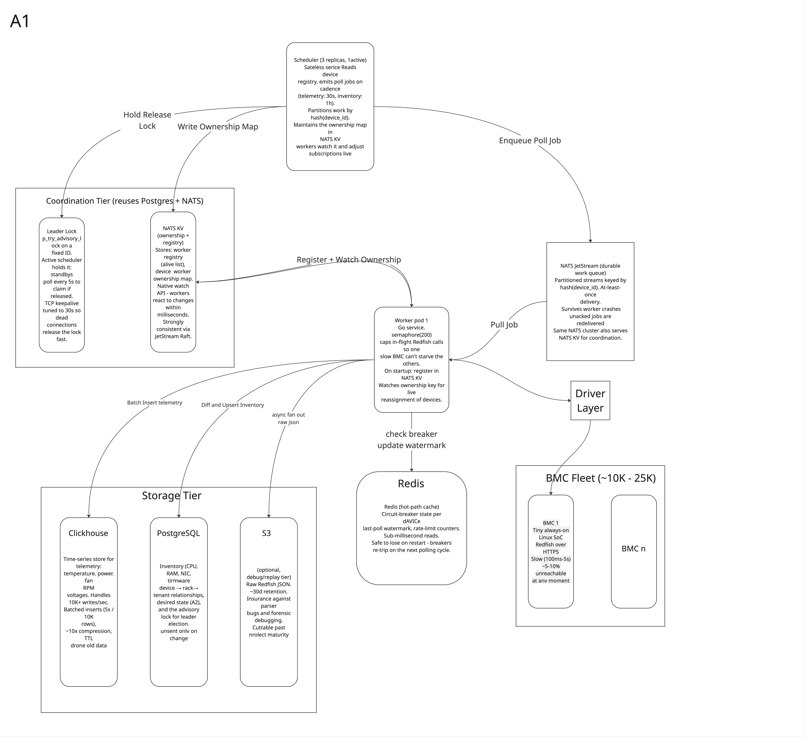
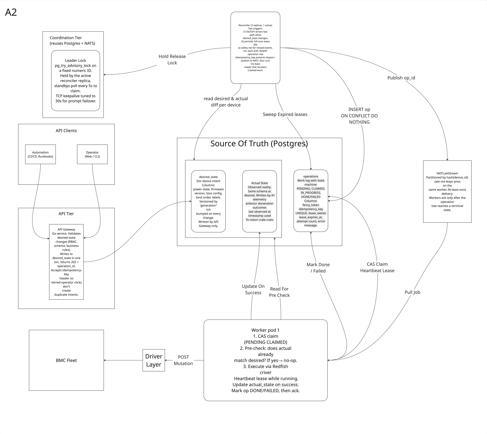
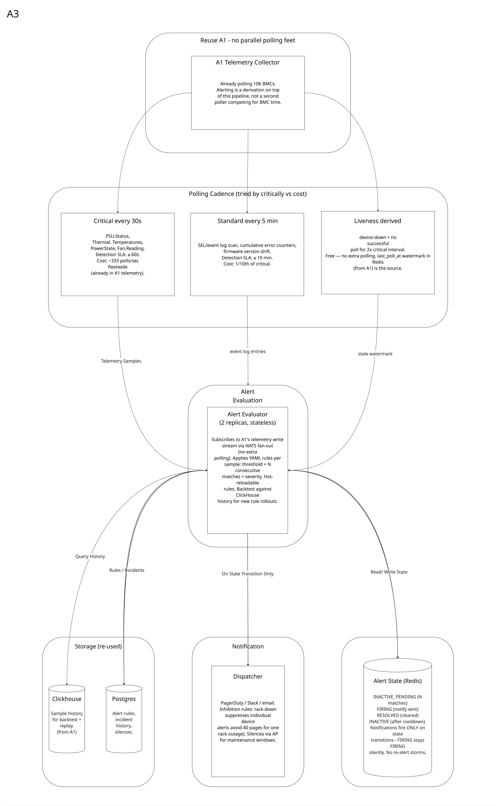
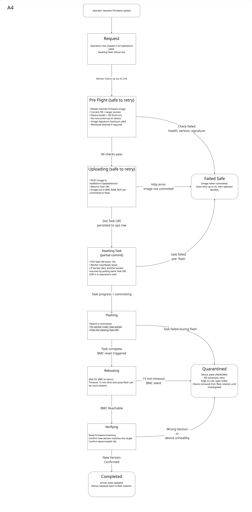
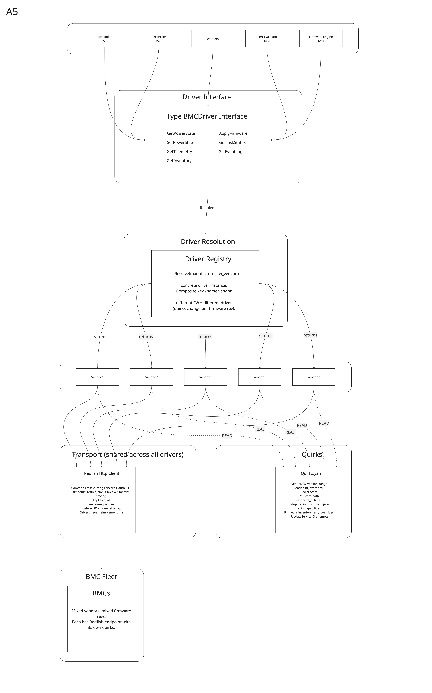

# Bare-Metal Server Management Platform -- Design

**Author:** Prateek Tyagi
**Date:** 24th May 2026
**Role:** Senior Systems / Backend Engineer (BMC & Server Infrastructure)
---

## Assumptions

- **Target scale:** 10K devices today with design headroom to 25K. The architecture below is drawn for the 10K case; each section notes what changes at 25K. At 1K I would collapse most of this - that's also called out where it matters.
- **Vendor mix:** single-vendor (Compal) today, multi-vendor on the roadmap. A5 addresses this explicitly so it doesn't become a rewrite later.
- **BMC reality:** calls take 100ms–5s; ~5–10% of devices are unreachable at any moment; devices cannot push events to us - everything is pulled.
- **Operational team:** small platform team (assume 3–5 engineers). This shapes several decisions toward "fewer moving parts" over "best-in-class for each concern."
- **Deployment target:** Kubernetes. Services are stateless and scale horizontally except where explicitly noted.

---

## A1 - Telemetry & Inventory Collector

_See `A1.jpg` for the architecture diagram._

### Architecture

Two stateless Go services do all the work: a **scheduler** and a **worker pool**. The scheduler runs as three replicas with one active leader (elected via Postgres advisory lock); it reads the device registry, decides which devices are due for polling, and publishes poll jobs to a NATS JetStream stream partitioned by `hash(device_id)`. Telemetry polls fire every 30 seconds; inventory polls every hour. The scheduler does no I/O against BMCs itself - it's a pure dispatcher.

The worker pool (10–20 pods, all active) consumes from the NATS work queue. Each worker uses a buffered-channel semaphore (`chan struct{}`) sized to 200 to cap in-flight Redfish calls - chosen over `errgroup.Group` because a single failing BMC must not cancel sibling polls; per-target errors are captured into results, and the only signal that aborts the run is root-context cancellation. Before each call, the worker checks a per-device circuit breaker in Redis; devices that have failed N times in a row are skipped cheaply. Calls have a 3-second per-call context timeout (configurable via `--timeout`) with retry-and-jitter on transient failures. On graceful shutdown (SIGTERM), the worker stops pulling new jobs and drains in-flight work cleanly via context cancellation.

The output side is where the most interesting design choice sits. Workers do **not** write directly to ClickHouse. Instead, they publish parsed samples to a NATS telemetry stream, and a thin **ClickHouse Batcher** service subscribes, buffers 5s/10K rows, and does batched inserts. This decouples worker publish rate from ClickHouse ingest pressure, and - critically - gives A3's Alert Evaluator a stream to subscribe to without polling ClickHouse. Inventory (slow-changing, structured, needs joins) is written directly to Postgres by the worker. Raw Redfish JSON is fanned out asynchronously to S3/MinIO for a 30-day debug window.

Coordination state lives in three different stores chosen for their access patterns. Postgres holds the leader advisory lock and the inventory source-of-truth. **NATS KV** (built into JetStream - no new cluster) holds the worker registry and the device→worker ownership map, with native watch semantics so workers react to ownership changes within milliseconds. **Redis** holds hot-path state - per-device circuit breaker, last-poll watermark - with sub-millisecond reads on the critical path. None of these are interchangeable; each one's failure mode is acceptable in isolation (Redis loss → breakers reset, no correctness issue; NATS KV loss → workers stop receiving ownership updates but continue with current map).

The whole telemetry pipeline at 10K devices runs at ~333 polls/sec sustained and produces roughly 24GB/day of parsed metrics into ClickHouse plus ~600GB/day of raw JSON into S3. Headroom to 25K is mostly horizontal scaling on the worker pool with one architectural change noted below.

### Key decisions

**NATS JetStream over Postgres-as-a-queue or Kafka.** Postgres `FOR UPDATE SKIP LOCKED` works fine at 1K devices but at 333+ pulls/sec across 20 workers, the row-locking and vacuum churn make it the wrong tool - Postgres becomes a contended resource for queue mechanics that don't need durability the way our inventory does. Kafka would also work but is operationally heavier than NATS for our throughput, and we'd be running a second clustered system alongside Postgres. NATS JetStream gives us at-least-once delivery, partitioned streams (for device→worker affinity), durable consumers, and a built-in KV store - all from one cluster. The advantage Kafka has - massive throughput, mature ecosystem - only matters at workloads we're nowhere near.

**ClickHouse + Postgres + S3 split, not one database.** Telemetry is high-write, append-only, columnar-friendly (timestamp + device_id + dozens of metrics, highly repetitive). At 10K writes/sec this is exactly ClickHouse's sweet spot - millions of rows/sec ingest, 10× compression, fast time-range scans, automatic TTL. Inventory is slow-changing, relational, transactional (joins for device→rack→tenant, ACID for desired-state updates from A2) - that's Postgres. Raw payloads are write-once, rarely-read, large blobs - that's object storage, and putting them in Postgres would pollute the database that holds our control-plane source of truth with 600GB/day of data that almost no query needs. The single-database alternative (Postgres + TimescaleDB) is genuinely correct at 1K devices; at 10K the split earns its complexity.

**Postgres advisory lock for scheduler leader election, not Consul/etcd.** Consul gives tighter failover (~15s explicit TTL vs ~30s tuned TCP keepalive), native watch semantics, and fencing tokens. We're not picking it because operating a dedicated coordination cluster is a real cost for a small platform team, and we can achieve equivalent safety with `pg_try_advisory_lock` plus tuned TCP keepalive (`tcp_keepalives_idle=30`, `tcp_keepalives_interval=10`, `tcp_keepalives_count=3`) plus monotonic fencing tokens stored in a `leadership` table (see A2). Consul's advantages only start mattering when (a) failover SLA drops below 30s, (b) Postgres becomes a contended coordination resource, or (c) the team is large enough to operate a third stateful system without it being a distraction. We are not at any of those points.

### Code spike (Part B)

The companion Go repo (`bmcpoll/`) implements the bounded concurrent polling pattern described above as a standalone CLI. It demonstrates:

- **Bounded concurrency** via a `chan struct{}` semaphore - chosen over `errgroup.Group` to avoid cancelling sibling polls on a single failure.
- **Pure context-driven cancellation.** `http.Client.Timeout` is intentionally unset; every request is wrapped in `context.WithTimeout(parent, PerCallTimeout)`. A hung server, a SIGTERM, and the total-run timeout all flow through the same cancellation path.
- **Per-attempt `defer cancel()`** inside the retry loop (not function scope), so cancel funcs don't accumulate across retries.
- **Buffered results channel** sized to `len(targets)` - workers never block on send, avoiding the "worker blocked on send while main blocks on WaitGroup" deadlock.
- **Context-aware backoff sleep** with full jitter; cancellation interrupts sleep immediately.
- **Graceful shutdown** via `signal.NotifyContext` - dispatcher stops feeding new targets, in-flight calls drain bounded by per-call timeout, partial summary is emitted.
- **Per-target result classification**: success / timeout / http_error / connection_error / cancelled / skipped - typed errors with `Unwrap` preserve the cause chain.

Tests cover (a) concurrency cap is never exceeded under load, (b) hung endpoints don't block sibling targets or the overall run, (c) graceful shutdown returns within bounded time with no goroutine leak (verified via `runtime.NumGoroutine()` baseline comparison), and (d) HTTP error classification (4xx and 5xx-after-retries both surface as `http_error`, not `connection_error`).

The spike is not a partial implementation of A1 - it isolates one mechanism (bounded concurrent fan-out with proper cancellation) so the pattern is testable in isolation. In the real collector, this loop would be wrapped by the NATS JetStream consumer, the Redis circuit breaker check, and the output fan-out to ClickHouse/Postgres/S3 described above.

### What changes at 25K

- **Shard the scheduler by device-id range.** The single active scheduler scanning 25K devices every 30s starts to strain - both the scan duration and the burst of NATS publishes at each tick. Split into N scheduler shards, each leader-elected independently, each owning a contiguous slice of the device-id hash space. NATS streams partition the same way so workers map cleanly.
- **ClickHouse becomes a small cluster.** Single-node ClickHouse handles 10K writes/sec comfortably but query latency on multi-day aggregations starts to climb past ~30K writes/sec. Sharded ClickHouse with replicated MergeTree adds operational cost but keeps query latency bounded.
- **Reconsider Consul.** At 25K the failure-domain coupling between Postgres (data + coordination) becomes a more real risk. If we're also adding multi-region, this is the trigger to extract coordination into a dedicated cluster.

---

## A2 - Control Plane / Source of Truth

_See `A2.jpg` for the architecture diagram._

### Architecture

A2 is the platform's brain: it holds operator intent and reconciles it against observed reality. A1 keeps `actual_state` fresh by polling; A2 keeps `actual_state` aligned with `desired_state` by issuing operations. The two loops share Postgres but never call each other - A2 reads what A1 wrote, A1 ignores A2 entirely. This is the Kubernetes controller pattern: kubelet observes, controllers act, API server is the shared state.

Three logical tables in Postgres anchor the design. **`desired_state`** holds per-device intent (power, firmware_version, BIOS config, boot order) versioned by a `generation` integer that bumps on every operator change. **`actual_state`** holds observed reality - same schema, written by A1's collectors and by A2's operation completions. **`operations`** is the work log with a state machine: PENDING → CLAIMED → IN_PROGRESS → DONE/FAILED, with columns for `idempotency_key` (UNIQUE), `lease_owner`, `lease_expires_at`, `attempt_count`, plus `created_by_token` and `claimed_by_token` for fencing (more below).

The **reconciler** runs as three replicas with one active via Postgres advisory lock. The active reconciler has two triggers: a NOTIFY-driven fast path that wakes it on `desired_state` changes, and a 30-second periodic scan as a safety net for missed events. On each cycle, for each device, it compares desired vs actual; on drift, it INSERTs an operation row with `idempotency_key = hash(device_id, generation, op_type)` using `ON CONFLICT DO NOTHING`. This means duplicate runs (e.g., during a brief leadership flap) cannot create duplicate work - the database constraint is the deduplication mechanism. After the INSERT commits, the reconciler publishes the op_id to NATS (partitioned by hash(device_id), same as A1's poll queue).

The **operation workers** are the same pods as A1's pollers - different NATS consumer group, same binary. When a worker receives an op_id, it claims the operation via a compare-and-swap UPDATE: `SET state='CLAIMED', lease_owner=me, lease_expires_at=NOW()+30s WHERE id=? AND state='PENDING'`. If zero rows are affected, someone else won the claim - ack and move on. Before mutating the BMC, the worker reads `actual_state` and asks: "does this operation already need to happen, or did A1's last poll already see it converged?" If actual already matches desired, the worker marks DONE with `notes='converged, no-op'` and acks - this is the pre-check that makes recovery from crashed workers safe (see below). Otherwise it executes the Redfish call, polls any async Task, updates `actual_state` on completion, marks the operation DONE, and acks.

Crash recovery is the architecturally interesting part. When a worker dies mid-operation, NATS won't redeliver immediately - instead, the reconciler runs a **lease reaper** every 10 seconds that sweeps `operations WHERE state='CLAIMED' AND lease_expires_at < NOW()`, resets them to PENDING, and re-publishes to NATS. A new worker picks up the operation, claims it, runs the actual-state pre-check, and - if the deceased worker's call already reached the BMC and was executed - sees actual matches desired and marks DONE without re-applying. This gives us **effectively-once execution on top of at-least-once delivery**, which is the strongest guarantee actually achievable.

### Key decisions

**Operations as durable rows, not just messages.** We could store operation state purely in NATS (using JetStream's at-least-once + dedup window). We don't, because operations need history, lease semantics, retry counts, and join-ability with desired/actual state - all relational concerns that NATS isn't built for. The operation row IS the source of truth; the NATS message is a notification that work exists. This also gives us "what was the last operation on device X?" as a simple SQL query rather than a stream scan.

**Fencing tokens via a `leadership` table.** Postgres advisory locks alone don't defend against the "paused leader resumes and writes" scenario - the deposed leader has no way to know it lost the lock. We add a monotonic `current_token` in a `leadership` table, bumped on every lock acquisition. Every leader-dependent write includes `WHERE my_token >= (SELECT current_token FROM leadership WHERE role='reconciler')` in its SQL. A deposed leader's writes affect zero rows. This gives us the same correctness as Consul's session-index fencing, enforced at the database layer, with no new infrastructure. The residual gap - a paused worker resumes and re-fires a Redfish call directly to the BMC, which doesn't speak fencing tokens - is mitigated by setting `lease_timeout >> http_timeout` (30s vs 5s) and by the actual-state pre-check. Consul wouldn't have solved this either, because the BMC is the unreachable end of the fence.

**Lease + reaper recovery, not message-redelivery dedup.** NATS will redeliver an unacked message after a timeout, but for long-running ops (firmware updates can take 20+ minutes) the timeout would have to be implausibly long. We use short message-ack windows but a database-backed lease with explicit heartbeats. The lease reaper handles recovery; messages get acked quickly. This pattern works for operations that span minutes; relying on NATS redelivery alone would not.

### What changes at 25K

- **Shard the reconciler.** A single active reconciler scanning 25K devices every 30s and running the lease reaper every 10s starts competing with its own scan cycle. Same fix as A1's scheduler: shard by device-id range, one leader per shard. The `operations` table also gets partitioned by `hash(device_id)` to keep lease-sweep queries fast.
- **Archive completed operations.** At 25K with steady-state churn, the operations table grows fast. Move terminal rows (DONE/FAILED older than 30 days) to a cold archive table or to ClickHouse, keep the hot table small.

---

## A3 - Alerting Without Push

_See `A3.jpg` for the alerting pipeline._

The constraint here is that devices cannot push events to us - everything is pulled. The cheap mistake is to build a parallel polling fleet just for alerting. We don't: **A1's collector is already polling, and alerting is a derivation on top of A1's data stream, not a second subsystem competing for BMC time.**

Polling uses three tiered cadences. **Critical** (30s) covers PSU status, thermals, power state, fan speed - these need fast detection because the consequence of missing them is hardware damage. **Standard** (5min) covers SEL/event log scans, cumulative error counters, firmware version drift - slower-evolving conditions where 10-minute detection is fine. **Liveness** is free - we don't poll for it, we derive it from `last_poll_at < 2× critical_interval` against Redis watermarks already written by A1. The 30-second critical interval is the cost-detection trade-off: at this rate the fleet generates ~333 polls/sec (already absorbed by A1's worker pool), and halving the interval would double BMC load for only a 30s detection improvement - not worth it for thermal/PSU alerts.

The **Alert Evaluator** runs as two stateless replicas and subscribes to the NATS telemetry stream (the same one A1's ClickHouse Batcher consumes - different consumer group, independent backpressure). Rules are YAML: threshold + N consecutive matches + severity, hot-reloadable on SIGHUP. **New rules are backtested against the last 30 days of ClickHouse history before deployment** - replay catches threshold mistakes that would have paged on-call 500 times. Rules ship behind a feature flag so we can enable per-rack before fleet-wide.

Deduplication is a state machine per `(device_id, rule_id)` in Redis: `INACTIVE → PENDING (N samples) → FIRING (notification sent) → RESOLVED (cleared) → INACTIVE (after cooldown)`. **Notifications fire only on state transitions** - a device that's been FIRING for an hour produces one page, not 120. Inhibition rules use rack topology from the Postgres inventory table to suppress individual alerts when their parent (rack-down, dc-down) is firing - operator gets one "rack 14 unreachable" alert, not 40 device-down alerts.

**At 25K:** the evaluator is stateless and horizontally scales; the bottleneck is Redis dedup-state lookups. Move to Redis Cluster or sharded Redis. The rules themselves don't change.

---

## A4 - Firmware Update Engine

_See `A4.jpg` for the per-device state machine._

Firmware updates are the most dangerous operation in the platform - a failed write bricks a board and costs thousands of dollars. The design is built around one principle: **identify the irreversible step, and never retry across it.**

Per device, the operation moves through eight states. Everything before FLASHING is safe - the image sits in BMC RAM but isn't committed to flash. Worker crashes during PRE_FLIGHT, UPLOADING, or AWAITING_TASK fall back to FAILED_SAFE with auto-retry. **FLASHING is the danger zone:** the board is committed to the write, and the worst thing we could do is re-POST the image. Instead, the Task URI is persisted to the operations row; a new worker picks up the operation by **polling that same Task URI**, never starting a new upload. After flashing comes REBOOTING (15-minute timeout - empirically BMCs return in 2–5 minutes for normal reboots, but first-boot post-flash can be much slower; the 15-minute number is ~2× the worst observed case, configurable per-vendor in quirks.yaml) and finally VERIFYING (read FirmwareInventory, confirm new version matches target). Anything that fails in or after FLASHING goes to QUARANTINED, which is a hard stop: no automatic retry, page on-call, device removed from fleet rotation until investigated. Quarantine is intentionally aggressive - a possibly-bricked board should not be re-attempted by automation.

Above the per-device state machine sits a **fleet rollout campaign**, three phases with explicit halt thresholds. Canary first: 5 hand-picked devices, one per rack across 5 racks, all currently idle. Manual approval gate after all 5 reach COMPLETED - humans decide whether to proceed. Wave 1 covers 5% of fleet with concurrency capped at 50 in flight and 2 per rack (avoids thermal/power excursions when many devices reboot simultaneously); auto-halt if failure rate exceeds 1%. Wave 2 is everything else with concurrency 100 and stricter 0.5% halt threshold, because obvious issues should have surfaced in earlier phases. The campaign itself has a small state machine - RUNNING / PAUSED / ABORTED / HALTED / COMPLETED - that the operator drives via API. The single safety invariant: **no campaign state transition interrupts a device past PRE_FLIGHT.** Operator hits abort during a flash, the campaign goes ABORTED but the 47 devices currently in FLASHING/REBOOTING complete naturally because interrupting them is more dangerous than letting them finish.

**At 25K:** the per-device state machine doesn't change. The campaign dispatcher needs better visibility - at this scale a single rollout might run for days, and operators need real-time dashboards of phase progress, current failure rate against threshold, and quarantine reasons. This is a UX problem more than an architecture one.

---

## A5 - Vendor-Agnostic Driver Layer

_See `A5.jpg` for the driver layer architecture._

The brief notes that BMC quirks change per firmware revision - not just per vendor. The driver layer is built around this fact: vendor identity alone is not enough to pick the right behavior.

A narrow Go interface - **`BMCDriver`** - defines the operations the platform needs: `GetPowerState`/`SetPowerState`, `GetTelemetry`, `GetInventory`, `ApplyFirmware`, `GetTaskStatus`, `GetEventLog`, plus a `Capabilities()` method that returns a struct of feature flags. Business logic (scheduler, reconciler, workers, alert evaluator, firmware engine) consumes this interface and **never branches on vendor name or protocol** - it branches on capability flags. If a driver returns `SupportsAsyncFirmwareTask: false`, the firmware engine takes a different code path or refuses the operation with a clear error. Capability flags are how cross-vendor differences become decisions in business logic without leaking the differences.

Concrete drivers live below the interface: `CompalRedfishDriver` (today's vendor), `DellRedfishDriver`, `HPERedfishDriver`, a `GenericRedfishDriver` spec-compliant fallback that new vendors start with, and **`IPMIDriver`** as a parallel implementation for the case from §1 of the brief where Redfish is unavailable. IPMI is a separate driver, not a quirk inside a Redfish driver - the protocols are too different to share transport. The **DriverRegistry** resolves on the composite key `(manufacturer, firmware_version, preferred_protocol)` and returns the right driver; Redfish is tried first, IPMI as fallback.

Quirks live in **`quirks.yaml`** - endpoint overrides, response patches (e.g., strip trailing comma in malformed JSON), skip lists for unsupported capabilities, retry overrides, vendor-specific reboot timeouts. Quirks are **data, not code**: hot-reloadable on SIGHUP, tested with the driver code in CI, code-adjacent rather than runtime-DB-resident. The defense for YAML over Postgres is that quirks change with the codebase that consumes them, and adding a runtime database dependency for something that doesn't change between deploys would only hurt us in the rare emergency-patch case - which SIGHUP already covers.

Adding a new vendor is three commits in this order: (1) add `quirks.yaml` entries describing where the vendor deviates from spec-compliant Redfish, (2) try `GenericRedfishDriver` with those quirks - if it works, you're done; (3) if vendor-specific code is required (non-standard endpoints, multi-step flows), add a new driver type that composes `GenericRedfishDriver` and overrides only the methods that differ. **Business logic does not change.** The interface is the contract; everything below it is implementation detail.

**At 25K with multi-vendor:** the quirks file grows but stays manageable (hundreds of entries is still tens of KB, O(1) in-memory lookup). The driver registry might benefit from per-vendor metrics and per-quirk activation counts so we can see which workarounds are actually getting hit in production.

---

## What I deliberately left out

Calling these out per the brief's "scope honestly" guidance - these are real gaps, not oversights:

- **Authn/authz, secrets, and credential rotation.** The API Gateway in A2 needs RBAC; BMC credentials need a vault story; Redfish sessions need token lifecycle management. None of this is in the diagrams. The right answer is a per-device credential record in Postgres encrypted at rest, with rotation handled by a separate workflow. I'd add it before going to production but it's not core to the architectural questions being graded.
- **Observability stack.** Metrics, structured logs, distributed tracing - assumed (Prometheus, Loki, OpenTelemetry) but not drawn. Every Go service exposes `/metrics` and trace headers propagate through NATS. The interesting design question - how to alert on the platform itself vs the devices it manages - is out of scope for this doc.
- **Multi-region / multi-DC topology.** The design assumes a single deployment serving one fleet. At 25K+ with geographic distribution, you'd want regional schedulers, regional NATS clusters, and a federation story for the global control plane. This is a substantial extension to A2 and deserves its own design doc.
- **A4 staged rollback / firmware downgrade.** Forward updates are covered; deliberately downgrading firmware fleet-wide (because vN+1 introduced a regression) uses the same operation engine but has its own gotchas around BMC behavior on downgrade - some refuse, some require special flags. Worth a follow-up after the first vendor relationship is mature enough to know the failure modes.
- **Capacity planning math.** The numbers in this doc (~333 polls/sec, ~24GB/day metrics, ~600GB/day raw) are estimates. Real provisioning would require benchmark runs against actual Compal BMCs to size worker pool, ClickHouse shards, and NATS retention. The architecture doesn't change based on those numbers; the resource sizing does.

---